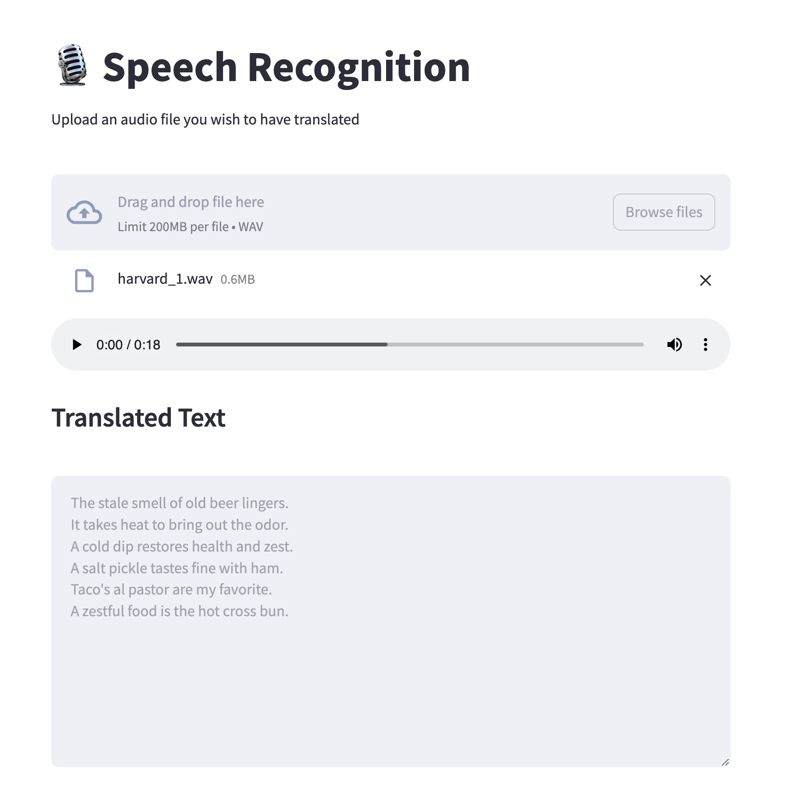

<!-- Original Recipe README: https://github.com/containers/ai-lab-recipes/blob/main/recipes/audio/audio_to_text/README.md
-->

# **Audio to Text Software Template**

## **Using The Template**

This AI Software Template provides you with some customization to alter the final generated result. Aside from being able to input your desired name for the application and container image you can control:

- The owner listed through Red Hat Developer Hub (RHDH).
- The desired Git organization and repository.
- The namespace the application and applicable model servers are deployed to.

!!! tip "Git Repositories"

    You can choose between GitHub and GitLab as your desired Source Code Management (SCM) platform, and the template fields will update accordingly!

This template provides the option to supply your own model and model server. By utilizing this option you will need to ensure that the model supports Automatic Speech Recognition (ASR).

## **Deployable Application**

This AI Software Template will create a web application that utilizes the [ggerganov/whisper.cpp](https://huggingface.co/ggerganov/whisper.cpp) model to transform audio files into text. 

!!! note

    This model is classified as an "Automatic Speed Recognition (ASR)" model. These models are specifically trained and designed to accurate transcribe spoken language into written text!

    The model provided for use with this application is licensed under the MIT license.

The image below is an example of what you can expect to see from your deployed application. This example shows the text result of an audio file uploaded by the user called `harvard_1.wav`.

*[Application Source Code](https://github.com/redhat-ai-dev/ai-lab-samples/tree/main/audio-to-text)*

!!! info "Allowable Media Types"

    This application allows you to upload audio files from the following media types:

    - .wav
    - .mp3
    - .mp4
    - .flac

### **Technologies Used**

This application was created with Python 3.11, and heavily relies on [Langchain](https://python.langchain.com/docs/introduction/) to simplify the communication with the model service (whisper.cpp).

[Streamlit](https://streamlit.io/) is utilized to construct the entire application web interface.
